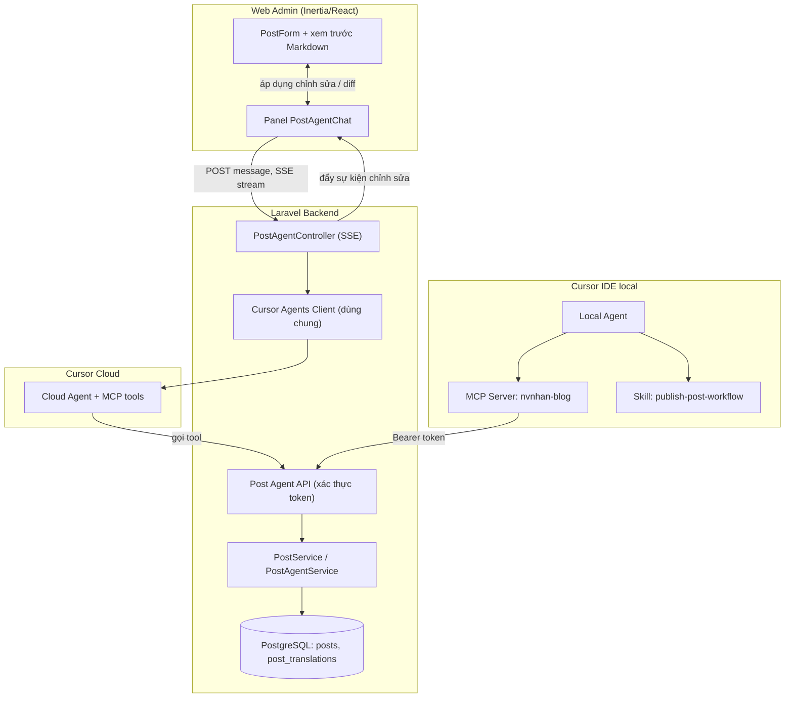
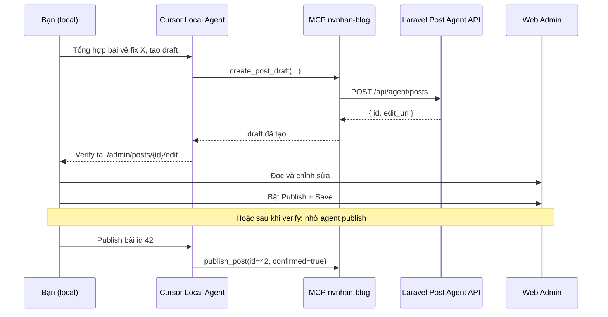

# Post Agent — Kế hoạch Chat & MCP

> **Trạng thái:** Chỉ lên kế hoạch — chưa implement.  
> **Mục tiêu:** Hỗ trợ tạo và chỉnh sửa bài viết bằng AI qua (A) khung chat agent trong trang admin create/edit, và (B) MCP server + skill trên máy local để agent Cursor có thể tạo draft và publish bài lên web sau khi bạn verify.

---

## Ý tưởng sản phẩm

Hai luồng bổ sung cho nhau, dùng chung một lớp **Post Agent API**:

| Luồng | Ai dùng | Mục đích |
|-------|---------|----------|
| **A. Chat trong admin** | Bạn trên trình duyệt (`/admin/posts/create`, `/edit`) | Chat với agent; agent chỉnh sửa nội dung draft trực tiếp trên form |
| **B. Agent local** | Agent Cursor IDE khi làm việc trên máy local | Tổng hợp bài từ session → tạo/cập nhật draft trên web → bạn verify → publish |

**Nguyên tắc:**

1. `CURSOR_API_KEY` chỉ ở phía server — frontend không gọi Cursor API trực tiếp.
2. Agent không publish ngầm — mặc định `is_published = false`; publish cần xác nhận rõ ràng từ người dùng.
3. Mọi thay đổi đi qua Post Agent API đã validate, có audit log.
4. Tái sử dụng pattern từ `CursorCloudAgentsClient` (Reading Digest) nhưng tách thành Cursor client dùng chung.

---

## Tổng quan kiến trúc



---

## Codebase hiện tại (baseline)

| Khu vực | Vị trí | Ghi chú |
|---------|--------|---------|
| Model blog | `app/Models/Post.php`, `PostTranslation.php` | Bản dịch `en` / `vi`, markdown lưu trong DB |
| Admin CRUD | `app/Http/Controllers/Admin/PostController.php` | Inertia create/edit/store/update |
| UI form bài viết | `resources/ts/components/posts/PostForm.tsx` | Markdown theo locale + xem trước trực tiếp |
| Định dạng markdown | `resources/ts/utils/postMarkdown.ts` | `# title`, `> description`, `Tags: ...`, nội dung |
| Cursor API (digest) | `app/Domains/ReadingDigest/Infrastructure/Llm/CursorCloudAgentsClient.php` | Cloud Agents REST, poll-based |
| MCP / agent-posts | — | Chưa có; branch `feature/agent-posts` đang WIP |

---

## Luồng A — Chat agent trong trình duyệt

### UX (trang create/edit)

```
┌─────────────────────────────┬──────────────────┐
│  Trình soạn Markdown (en/vi)│  Agent Chat      │
│  Xem trước trực tiếp        │  ─────────────   │
│                             │  [tin nhắn...]   │
│  Tags, Series, Publish      │  [ô nhập]        │
└─────────────────────────────┴──────────────────┘
```

**Hành vi:**

- Mỗi bài viết (hoặc mỗi lần tạo mới) có **một agent session** riêng, lưu `cursor_agent_id` + transcript.
- Agent nhận context hiện tại: markdown `en`/`vi`, title, tags, slug, locale đang active.
- Khi agent sửa → frontend nhận **edit events** (SSE) → cập nhật state `PostForm` → preview đổi ngay.
- Mỗi lần sửa hiện **diff** nhỏ (Chấp nhận / Từ chối), hoặc tự áp dụng lên form và bạn bấm Save thủ công.
- Nút **Save** hiện tại vẫn là bước lưu chính thức vào DB (MVP).

### Thành phần backend

**Domain mới:** `app/Domains/PostAgent/` (hoặc `app/Services/PostAgent/` nếu muốn đơn giản hơn)

| Thành phần | Trách nhiệm |
|------------|-------------|
| `CursorAgentsClient` | Tạo/resume agent, gửi prompt, poll/stream run (tách từ Reading Digest) |
| `PostAgentSession` | Model: `post_id`, `cursor_agent_id`, `status`, metadata |
| `PostAgentController` | `POST /admin/posts/{id}/agent/messages` + SSE `GET .../stream` |
| `PostContextBuilder` | Dựng system prompt + snapshot nội dung bài hiện tại |
| `PostEditApplier` | Parse chỉnh sửa có cấu trúc từ agent → validate → emit event cho frontend |

**Tích hợp Cursor:** Cloud Agents REST API (`/v1/agents`) từ Laravel, hoặc `@cursor/sdk` trong Node sidecar nếu cần streaming tốt hơn. REST + polling/SSE đủ cho MVP.

**Cơ chế agent chỉnh sửa (theo giai đoạn):**

| Cách | Ưu điểm | Nhược điểm |
|------|---------|------------|
| **Structured output** (agent trả JSON patch) | MVP đơn giản hơn | Ít linh hoạt, phụ thuộc prompt |
| **MCP HTTP tools** (agent gọi Laravel API) | Cùng tool với MCP local, mạnh hơn | Cần endpoint MCP HTTP |

**Khuyến nghị:** MVP dùng structured output; Phase 3 chuyển web chat sang MCP tools dùng chung.

**Ví dụ edit event:**

```json
{
  "type": "edit_post",
  "operations": [
    { "path": "translations.en.content", "action": "replace", "value": "..." },
    { "path": "translations.vi.title", "action": "set", "value": "..." },
    { "path": "tags", "action": "append", "value": ["laravel", "cursor"] }
  ],
  "summary": "Viết lại phần mở đầu và thêm tags"
}
```

### Thành phần frontend

| File (dự kiến) | Mô tả |
|----------------|-------|
| `resources/ts/components/posts/PostAgentChat.tsx` | UI chat, streaming, hiển thị edit events |
| `resources/ts/hooks/usePostAgent.ts` | SSE, gửi tin nhắn, quản lý session |
| `resources/ts/types/postAgent.ts` | Kiểu Message, EditOperation |
| `PostForm.tsx` (sửa) | Thêm panel chat, expose setter cho agent edits |
| `EditPage.tsx` / `CreatePage.tsx` (sửa) | Layout hai cột |

---

## Luồng B — MCP server + skill (Cursor local)

### MCP server (ưu tiên)

Package trong repo: `packages/mcp-nvnhan-blog/`

**Transport:** stdio (Cursor local) + tùy chọn HTTP (cloud agent).

**Tools:**

| Tool | Mô tả |
|------|-------|
| `list_posts` | Danh sách draft/đã publish, có filter |
| `get_post` | Lấy full bài theo id hoặc slug |
| `create_post_draft` | Tạo bài mới, `is_published=false` |
| `update_post` | Cập nhật translations, tags, series |
| `preview_post_url` | URL trang admin edit để verify |
| `publish_post` | Set `is_published=true` — yêu cầu `confirmed: true` |

**Xác thực:** Bearer API token (machine-to-machine), không dùng session cookie.

**Cấu hình local** (ví dụ `.cursor/mcp.json`):

```json
{
  "mcpServers": {
    "nvnhan-blog": {
      "command": "node",
      "args": ["packages/mcp-nvnhan-blog/dist/index.js"],
      "env": {
        "BLOG_API_URL": "https://nvnhan0810.com",
        "BLOG_API_TOKEN": "..."
      }
    }
  }
}
```

### Skill (bổ sung cho MCP)

Đường dẫn dự kiến: `.cursor/skills/publish-post-from-session/SKILL.md`

**MCP = tay chân (gọi API). Skill = quy trình (khi nào / làm thế nào).**

Hướng dẫn trong skill cho agent local:

- Thu thập context từ session local (file đã đổi, commit, ghi chú).
- Gọi `create_post_draft` theo định dạng markdown trong `postMarkdown.ts` (`# title`, `> description`, `Tags: ...`).
- Luôn tạo **draft**; trả link admin edit.
- **Không** gọi `publish_post` trừ khi người dùng nói rõ muốn publish.
- Hỗ trợ `en` và `vi` khi được yêu cầu.

### Quy trình local (sequence)



---

## Post Agent API (lớp dùng chung)

Tách riêng khỏi route form Inertia. Bật lại `routes/api.php` kèm middleware.

**Routes:**

```
GET    /api/agent/posts
GET    /api/agent/posts/{id}
POST   /api/agent/posts              → luôn là draft
PUT    /api/agent/posts/{id}
POST   /api/agent/posts/{id}/publish → yêu cầu confirmed
```

**Middleware:** `AgentTokenMiddleware` — verify token từ bảng `agent_api_tokens` (hoặc single token trong env cho MVP).

**Validation:** Tái sử dụng rule từ `CreatePostRequest` / `UpdatePostRequest` qua `PostService` đã tách.

**Audit:** Bảng `post_agent_actions` — actor (user session hoặc token), action, tóm tắt diff, timestamp.

---

## Quyết định thiết kế cần chốt trước khi implement

| # | Câu hỏi | Khuyến nghị |
|---|---------|-------------|
| 1 | Web chat: cloud hay local agent? | **Cloud** cho admin (không cần Cursor local). Local chỉ cho luồng MCP. |
| 2 | Agent sửa: chỉ cập nhật form hay auto-save DB? | **MVP: chỉ form**; user bấm Save. Phase 2: tùy chọn auto-save draft. |
| 3 | Một session agent cho mỗi bài hay global? | **Mỗi bài một session** — resume qua `cursor_agent_id` đã lưu. |
| 4 | Publish qua agent cần xác nhận hai bước? | **Có** — `confirmed: true` + nên mở link admin trước. |
| 5 | Hỗ trợ en/vi ngay từ đầu? | **Có** — khớp model `post_translations`. |
| 6 | Context repo local trong web chat? | Web chat: chỉ nội dung bài. Agent local: đọc repo qua Cursor, đẩy qua MCP. |

---

## Bảo mật

1. **API token** — phạm vi hạn chế (`posts:read`, `posts:write`, `posts:publish`), có thể rotate.
2. **Rate limiting** — `throttle:agent-api` trên các route agent.
3. **Mặc định draft** — không publish ngầm.
4. **Redact log** — tránh lưu markdown nhạy cảm trong log session agent.
5. **CORS** — Agent API chỉ cho chat phía server + MCP, không mở CORS public cho browser.
6. **Auth admin** — whitelist `valid_emails` hiện tại cho UI; API token là kênh riêng cho máy.

---

## Các giai đoạn triển khai

### Phase 0 — Nền tảng (1–2 ngày)

- [ ] Tách `PostService` từ `PostController`
- [ ] Post Agent API + xác thực token
- [ ] Migration: `agent_api_tokens`, `post_agent_sessions`, `post_agent_actions`
- [ ] Config: `config/post-agent.php` (`CURSOR_API_KEY`, model, timeout)

### Phase 1 — MCP cho agent local (2–3 ngày)

- [ ] Package `packages/mcp-nvnhan-blog` với các tool cơ bản
- [ ] Ví dụ `.cursor/mcp.json` + hướng dẫn setup
- [ ] Skill: `publish-post-from-session`
- [ ] Test E2E: agent local → tạo draft → verify trong admin

### Phase 2 — Chat UI trong admin (3–5 ngày)

- [ ] `CursorAgentsClient` generic (tách từ Reading Digest)
- [ ] `PostAgentController` + SSE streaming
- [ ] `PostAgentChat` tích hợp vào `PostForm`
- [ ] Structured edit operations + xem trước diff
- [ ] Lưu session (resume agent khi quay lại trang edit)

### Phase 3 — Nâng cao

- [ ] MCP HTTP tools cho cloud agent (thay structured output)
- [ ] Auto-save draft khi agent chỉnh sửa
- [ ] Undo/redo cho các chỉnh sửa của agent
- [ ] Import context từ commit / mô tả PR
- [ ] Gộp với công việc trên branch `feature/agent-posts`

---

## Bản đồ tái sử dụng code

| Hiện có | Tái sử dụng cho |
|---------|-----------------|
| `CursorCloudAgentsClient.php` | Tạo agent, follow-up run, poll — **generalize** |
| `PostForm.tsx` + `postMarkdown.ts` | Định dạng markdown chuẩn cho output của agent |
| `CreatePostRequest` / `UpdatePostRequest` | Rule validation |
| Logic sync trong `PostController` | Chuyển sang `PostService` |
| Cấu trúc domain Reading Digest | Mẫu cho domain `PostAgent` |

---

## Rủi ro & cách giảm thiểu

| Rủi ro | Giảm thiểu |
|--------|-------------|
| Cursor API timeout với bài dài | Chia nhỏ chỉnh sửa; tăng timeout; stream phản hồi từng phần |
| Agent sửa sai nội dung | Xem trước diff + Từ chối; không auto-publish |
| Lộ MCP token | Chỉ dùng env local; token có scope; không commit |
| Chi phí Cursor API | Tái sử dụng session; chọn model phù hợp (`composer-2.5`) |
| User và agent cùng sửa một field | Cảnh báo xung đột; tùy chọn khóa locale |

---

## Câu hỏi mở

1. **Ưu tiên MVP:** MCP local trước, hay chat trên web trước?
2. **Auto-save:** Chỉ sửa trên form, hay lưu draft vào DB mỗi lần agent thay đổi?
3. **Locale:** Agent hỗ trợ cả `en` + `vi` ngay v1, hay một locale trước?

---

## Tài liệu liên quan

- [Kế hoạch Article Digest](./article-digest-recommendation-plan.md) — tham chiếu tích hợp Cursor API hiện có
- [SSR production](./ssr-production.md) — route admin tắt SSR (liên quan panel chat)
