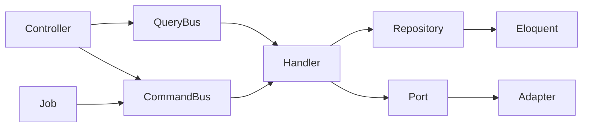

# FLC Backend — DDD / CQRS

Tài liệu kiến trúc backend sau khi migrate khỏi Event Sourcing sang **CQRS + Repository**.

## Quyết định

| Hạng mục | Giá trị |
|----------|---------|
| Style | CQRS + Repository (không Event Sourcing) |
| Write / Read | Domain entities + Eloquent repositories (projection tables) |
| Buses | Custom `Flc\Shared\Application\CommandBus` / `QueryBus` |
| Namespace | `Flc\` → [`backend/src/Flc/`](../backend/src/Flc/) |
| Wiring | [`app/Providers/FlcServiceProvider.php`](../backend/app/Providers/FlcServiceProvider.php) |
| TDD | Outside-in: Feature → Unit handler/repo → implement |

## Before → After

### Trước

```
app/
  Http/Controllers/{Api,Web,Admin}/
  Services/          # transaction scripts
  Models/            # Eloquent = domain
  Jobs/
```

### Sau (đích)

```
src/Flc/
  Shared/            # CommandBus / QueryBus
  Dictionary/ Vocabulary/ Media/ Listening/
  Quiz/ Identity/ Notification/ AdminSettings/
app/Http/...         # Thin adapters → CommandBus / QueryBus
app/Jobs/...         # Thin adapters → CommandBus (queue retries/timeout)
```



## Đã migrate

| Context | Commands / Queries | Ports / Repos |
|---------|-------------------|---------------|
| Dictionary | LookupWord, Upsert/Curate/Delete | `DictionaryEntryRepository`, `FreeDictionaryGateway` |
| Vocabulary | Save/Update/Delete, List/Get | `UserVocabularyRepository` |
| Identity | Allowlist CRUD + IsEmailAllowed | `AllowedEmailRepository` |
| AdminSettings | Get/Set settings | `AppSettingsRepository` |
| Quiz | GetNextQuizQuestion, RecordQuizAttempt | `QuizAttemptRepository` |
| Notification | SendVocabQuizReminders, prefs | `PushNotifier` (FCM), reminder repos |
| **Media** | `ProcessMediaContent` | `MediaItemRepository`, `MediaContentResolver`, `ContentAnalyzer`, `ListeningAssessmentGenerator`, `MediaKeyVocabularyImporter` |
| **Listening** | Start/Resume session, SubmitAttempt, InitializeQuestions; Get options/questions/attempts | `ListeningAssessmentRepository` |

### Media / Listening cut-over

| Cũ | Mới |
|----|-----|
| `ProcessMediaContentJob` orchestration | Job → `CommandBus::dispatch(ProcessMediaContent)` |
| `MediaContentResolverService` / `ContentAnalysisService` | `DefaultMediaContentResolver` / `DefaultContentAnalyzer` |
| `ListeningAssessmentGeneratorService` | `DefaultListeningAssessmentGenerator` |
| `ListeningSessionService` | Listening commands/queries + Eloquent repo |
| Inline scoring in API controller | `SubmitListeningAttempt` handler |

## Layering rules

```
Delivery (Controller / Job / Console)  →  CommandBus / QueryBus  →  Handler (= Use Case)
Handler / Domain  →  Repository & Port interfaces only
Infrastructure    →  Eloquent, HTTP, FCM, Laravel helpers (Str, Arr, config, DB, Log, …)
```

- **Không** dùng `App\Services` facade giữa Controller và Bus.
- **Handler = Use Case** — không thêm lớp `*UseCase` / `*QueryService` song song.
- Domain + Application (Handler, Application services) **không** phụ thuộc Laravel helpers (`Str::`, `Arr::`, `config()`, `now()`, `Log::`, …).
  - Chuỗi: dùng `Flc\Shared\Support\Text`
  - Config / Clock / Logger: inject port `Flc\Shared\Application\{Config,Clock,Logger}` (adapter Laravel ở Infrastructure)
- Infrastructure concrete **được** dùng `Illuminate\Support\Str`, `Arr`, Facades, Eloquent.
- Phân trang: Application trả `Flc\Shared\Application\PaginatedResult`; Controller (delivery) mới wrap `LengthAwarePaginator` nếu Blade cần `->links()`.
- Media helpers (YouTube, Storage, Schedule, Cursor): `src/Flc/Media/Infrastructure/...` — Controller inject trực tiếp concrete infra (không còn `app/Services`).

## Cut-over

```bash
./vendor/bin/sail artisan test
# hoặc
php artisan test
```

## TDD conventions

- Feature: `tests/Feature/` — HTTP/API behavior
- Unit: handler / generator / resolver qua buses hoặc Flc adapters
- Thêm feature: viết test → Command/Query + Handler → Repository/Port → thin controller/Job

## Còn lại

Không còn việc bắt buộc cho cut-over CQRS. Infra Media (YouTube / Storage / Schedule / Cursor) đã nằm dưới `src/Flc/Media/Infrastructure/`; Application port Identity không còn kiểu Laravel.

## Không đổi

- Public API JSON contract (extension/mobile)
- Sanctum / Socialite token flow
- Queue job class name (`ProcessMediaContentJob`) — callers vẫn `::dispatch($id)`

## Cách thêm Command mới (checklist)

1. Feature/Unit test (red)
2. `Application/Command|Query` + `Handler`
3. Port/Repository + Eloquent adapter nếu cần
4. Đăng ký map trong `FlcServiceProvider`
5. Controller/Job `dispatch` / `ask`
6. Xóa logic cũ trong Service nếu còn
