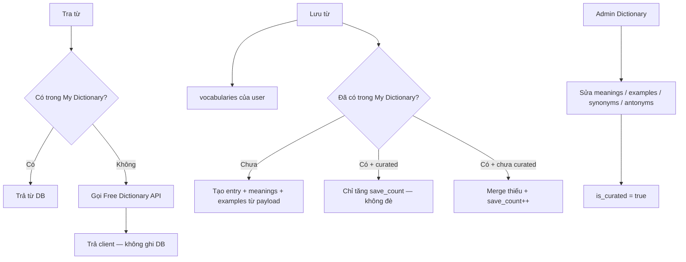

# My Dictionary — tài liệu implement

> Chỉ tài liệu thiết kế. **Chưa sửa code.**  
> Xây **My Dictionary** của FLC: lookup DB → API; **chỉ ghi DB khi user Lưu từ**; admin chỉnh nghĩa / example / đồng nghĩa / trái nghĩa.

---

## 1. Ý tưởng sản phẩm

| Khái niệm | Vai trò |
|-----------|---------|
| **My Dictionary** | Từ điển global FLC. Chỉ có từ đã được **Lưu từ** (hoặc admin tạo). |
| **Từ của tôi (`vocabularies`)** | Bản theo user để ôn / quiz — giữ như hiện tại. |
| **Free Dictionary API** | Fallback khi My Dictionary chưa có từ. **Không** ghi DB chỉ vì đã tra. |

### Hành động

| Hành động | Kết quả |
|-----------|---------|
| **Tra từ** | Đọc: My Dictionary → miss thì API. **Không persist.** |
| **Lưu từ** | Ghi vocab user **và** upsert My Dictionary (lần đầu tạo entry từ payload API). |
| **Admin** | Thêm/sửa nghĩa, example theo nghĩa, đồng nghĩa, trái nghĩa. |



---

## 2. Quyết định đã chốt

| # | Quyết định | Giá trị |
|---|------------|---------|
| 1 | Khi nào ghi My Dictionary? | **Chỉ khi Lưu từ** (hoặc admin tạo/sửa). Lookup miss **không** ghi. |
| 2 | Engine DB | **SQL — PostgreSQL** (xem §3) |
| 3 | Example | Gắn **theo từng nghĩa** (POS + definition), không chỉ theo từ |
| 4 | Đồng nghĩa / trái nghĩa | Có, gắn theo **từ** (và có thể theo nghĩa — xem §5) |

---

## 3. Chọn SQL hay NoSQL?

### Khuyến nghị: **SQL (PostgreSQL)** — giữ stack hiện tại

My Dictionary có quan hệ lồng nhau rõ:

```
Entry (từ)
  └─ Meaning (loại từ + định nghĩa)
       └─ Example(s)
  └─ Synonyms / Antonyms
```

| Tiêu chí | SQL (Postgres) | NoSQL (MongoDB / Document) |
|----------|----------------|----------------------------|
| Example theo từng nghĩa | FK `meaning_id` — rõ, dễ query | Nested array — được, nhưng sửa 1 example/admin form phức hơn |
| Admin CRUD từng dòng | Form + validation Laravel quen thuộc | Phải patch document / positional operator |
| Đồng nghĩa / trái nghĩa | Bảng quan hệ hoặc bảng cạnh | Mảng string trong document |
| Stack FLC hiện tại | **Đã dùng Postgres + Eloquent** | Thêm hệ thống mới, ops + backup riêng |
| Transaction khi Lưu từ | Vocab user + dictionary cùng transaction | Khó hơn nếu 2 store |
| Full-text sau này | `tsvector` / pg_trgm | Có, nhưng không cần thiết Phase 1 |

**Khi nào cân nhắc NoSQL?** Nếu payload cực linh hoạt theo nguồn API khác nhau và gần như không admin chỉnh cấu trúc — không phải case này (có admin + example theo nghĩa).

**Kết luận:** Dùng **PostgreSQL**, schema quan hệ (hoặc JSONB phụ cho metadata nếu cần). Không introduce Mongo chỉ cho dictionary.

---

## 4. Lookup (không ghi DB)

```
1. Normalize word
2. SELECT My Dictionary (+ meanings, examples, synonyms, antonyms)
   → HIT: trả payload FLC
3. MISS: Free Dictionary API
   → Trả payload normalize cho client
   → Không INSERT dictionary
4. API fail → 404
```

Cache HTTP ngắn (Redis) **optional** sau này cho API miss lặp lại trong vài phút — khác My Dictionary, không thay quyết định “chỉ Lưu từ mới vào DB”.

---

## 5. Cấu trúc bảng (SQL)

### Tổng quan quan hệ

```mermaid
erDiagram
  dictionary_entries ||--o{ dictionary_meanings : has
  dictionary_meanings ||--o{ dictionary_examples : has
  dictionary_entries ||--o{ dictionary_synonyms : has
  dictionary_entries ||--o{ dictionary_antonyms : has

  dictionary_entries {
    bigint id PK
    string word UK
    string phonetic
    string audio_url
    string source
    bool is_curated
    int save_count
    timestamp timestamps
  }

  dictionary_meanings {
    bigint id PK
    bigint dictionary_entry_id FK
    string part_of_speech
    text definition
    int position
  }

  dictionary_examples {
    bigint id PK
    bigint dictionary_meaning_id FK
    text example
    int position
  }

  dictionary_synonyms {
    bigint id PK
    bigint dictionary_entry_id FK
    string term
    bigint dictionary_meaning_id FK_nullable
    int position
  }

  dictionary_antonyms {
    bigint id PK
    bigint dictionary_entry_id FK
    string term
    bigint dictionary_meaning_id FK_nullable
    int position
  }
```

### `dictionary_entries`

| Cột | Kiểu | Ghi chú |
|-----|------|---------|
| `id` | bigserial PK | |
| `word` | `varchar(120)` unique | lowercase, trim |
| `phonetic` | `varchar(120)` nullable | |
| `audio_url` | `text` nullable | |
| `source` | `varchar(40)` | `user_save` \| `admin` \| `dictionaryapi.dev` (lúc seed từ payload save) |
| `is_curated` | `boolean` default `false` | Admin đã sửa → khóa ghi đè từ Lưu từ |
| `save_count` | `unsigned int` default `0` | Số lần user Lưu từ |
| `created_at` / `updated_at` | timestamps | |

### `dictionary_meanings` — mỗi dòng = một nghĩa (kèm loại từ)

| Cột | Kiểu | Ghi chú |
|-----|------|---------|
| `id` | bigserial PK | |
| `dictionary_entry_id` | FK → entries, cascade delete | |
| `part_of_speech` | `varchar(40)` nullable | `noun`, `verb`, `adjective`, … |
| `definition` | `text` | |
| `position` | `int` default `0` | Thứ tự hiển thị |
| timestamps | | |

Index: `(dictionary_entry_id, position)`.

### `dictionary_examples` — example **theo từng nghĩa**

| Cột | Kiểu | Ghi chú |
|-----|------|---------|
| `id` | bigserial PK | |
| `dictionary_meaning_id` | FK → meanings, cascade delete | |
| `example` | `text` | Câu ví dụ |
| `position` | `int` default `0` | Nhiều example / một nghĩa |
| timestamps | | |

Đây là điểm khác payload Free Dictionary API (thường 0–1 example / definition): FLC cho phép **nhiều example per meaning**.

Khi import từ API lúc **Lưu từ**: nếu definition có `example` → tạo 1 row trong `dictionary_examples`.

### `dictionary_synonyms` — từ đồng nghĩa

| Cột | Kiểu | Ghi chú |
|-----|------|---------|
| `id` | bigserial PK | |
| `dictionary_entry_id` | FK → entries, cascade | Bắt buộc — thuộc từ nào |
| `term` | `varchar(120)` | Từ đồng nghĩa (text; chưa cần FK sang entry khác) |
| `dictionary_meaning_id` | FK → meanings, **nullable** | `null` = đồng nghĩa cấp **cả từ**; có id = theo **nghĩa cụ thể** |
| `position` | `int` default `0` | |
| timestamps | | |

### `dictionary_antonyms` — từ trái nghĩa

Cùng cấu trúc `dictionary_synonyms`.

**Vì sao `meaning_id` nullable?**

- Free Dictionary / WordNet hay gắn synonym theo sense (nghĩa).
- Admin có thể gắn “synonym của cả từ” cho đơn giản.
- Phase 1: cho phép cả hai; UI admin ưu tiên gắn theo nghĩa khi đang edit meaning.

Unique gợi ý: `(dictionary_entry_id, term, dictionary_meaning_id)` để tránh trùng (dùng sentinel hoặc partial unique nếu `meaning_id` null — Postgres partial index).

---

## 6. JSON trả về client (mở rộng có kiểm soát)

Giữ tương thích field cũ; **thêm** synonyms / antonyms / examples dạng list:

```json
{
  "word": "bright",
  "phonetic": "/braɪt/",
  "audio_url": "https://...",
  "meanings": [
    {
      "part_of_speech": "adjective",
      "definition": "Giving out or reflecting much light",
      "examples": [
        "The bright sun hurt my eyes.",
        "A bright room with large windows."
      ],
      "synonyms": ["luminous", "radiant"],
      "antonyms": ["dark", "dim"]
    },
    {
      "part_of_speech": "adjective",
      "definition": "Intelligent and quick-witted",
      "examples": ["She is a bright student."],
      "synonyms": ["clever", "smart"],
      "antonyms": ["dull"]
    }
  ],
  "synonyms": ["brilliant"],
  "antonyms": [],
  "source": "flc",
  "curated": true
}
```

### Tương thích ngược

Clients hiện dùng `meaning.example` (string | null). Khi implement:

- **Option 1 (khuyến nghị):** trả cả `examples: string[]` và `example: examples[0] ?? null` để extension/mobile cũ không gãy.
- **Option 2:** Đổi client cùng lúc (breaking).

Synonyms/antonyms cấp entry (mảng top-level) = các term có `dictionary_meaning_id IS NULL`.  
Theo nghĩa = nằm trong từng object meaning.

API Free Dictionary miss (chưa Lưu từ) vẫn trả shape normalize hiện tại; có thể map `example` → `examples: [example]` khi có, `synonyms`/`antonyms` rỗng nếu API không có (Free Dictionary ít khi đủ — admin bổ sung sau khi đã Lưu từ).

---

## 7. Lưu từ — ghi My Dictionary

Trong transaction:

1. Tạo/ cập nhật `vocabularies` (+ `vocabulary_examples` như hiện tại).
2. Upsert My Dictionary:
   - **Chưa có `word`:** tạo `dictionary_entries` + meanings + examples từ payload vừa tra; `source = user_save` hoặc `dictionaryapi.dev`; `save_count = 1`.
   - **Đã có, `is_curated = false`:** merge nghĩa/example/synonym còn thiếu; `save_count++`.
   - **Đã có, `is_curated = true`:** chỉ `save_count++` (không đè nội dung admin).

Synonyms/antonyms từ Free Dictionary API thường **không đầy đủ** → lúc save có thể để trống; admin điền sau.

---

## 8. Admin Dictionary

| Màn | Nội dung |
|-----|----------|
| List | Search word, filter curated, sort save_count |
| Create | Tạo từ thủ công + meanings |
| Edit entry | Phonetic, audio, curated |
| Edit per meaning | POS, definition, **danh sách examples**, synonyms/antonyms **theo nghĩa** |
| Entry-level | Synonyms/antonyms chung (meaning_id null) |

UX: mỗi meaning là một card; trong card có repeater examples + chips/list synonym & antonym.

Save admin → `is_curated = true`.

Nav: `/admin/dictionary` — tách khỏi admin Vocabularies (user).

---

## 9. So với hiện trạng

| Hiện tại | Target |
|----------|--------|
| `dictionary_cache` TTL 7 ngày, ghi mỗi lần lookup | Bỏ (hoặc deprecate); My Dictionary chỉ khi Lưu từ |
| `meanings` JSON trong vocab; 1 `example` / meaning | Dictionary: bảng meanings + examples 1–n |
| Không synonym/antonym | Có bảng riêng |
| Admin sửa vocab user | Thêm admin My Dictionary |

Có thể **không** migrate `dictionary_cache` sang My Dictionary (vì policy mới khác: cache lookup ≠ từ đã lưu). Hoặc một lần import optional rồi drop `dictionary_cache`.

---

## 10. Phase triển khai

### Phase 1 — Schema + lookup/save

- Migration 5 bảng ở §5.
- `DictionaryService::lookup`: DB hit → return; miss → API, **no persist**.
- `DictionaryService::upsertOnSave`: gọi từ Vocabulary store/save.
- Payload: `examples[]` + `example` legacy; synonyms/antonyms có thể rỗng lúc mới save.
- Tests: lookup không INSERT; save mới INSERT; curated không bị đè.

### Phase 2 — Admin

- CRUD entry + meanings + examples + syn/ant.
- Curated lock.

### Phase 3

- Client UI hiện synonyms/antonyms + nhiều examples.
- (Optional) link `term` synonym tới entry khác nếu từ đó cũng có trong My Dictionary.
- Soft delete, metrics.

---

## 11. Checklist trước khi code / sau khi ship

- [x] Chỉ ghi DB khi Lưu từ
- [x] SQL Postgres, không NoSQL
- [x] Example theo meaning; nhiều example / nghĩa
- [x] Synonyms + antonyms (entry-level và/hoặc per-meaning)
- [x] Tương thích `example` + `examples[]`
- [x] Admin My Dictionary CRUD
- [x] Drop `dictionary_cache`
- [ ] (Optional) Redis cache ngắn cho API miss
- [ ] (Optional) Client UI hiện đầy đủ syn/ant + nhiều examples

> **Đã implement** trong backend (migration `2026_07_13_000001`, `DictionaryService`, admin `/admin/dictionary`).

---

## 12. Tóm tắt

**Postgres quan hệ:** Entry → Meaning → Examples; Synonyms/Antonyms gắn entry (và optional theo meaning).  
**Lookup:** DB rồi API, không ghi.  
**Lưu từ:** vào vocab user + tạo/làm giàu My Dictionary.  
**Admin:** curate nghĩa, example, đồng nghĩa, trái nghĩa.
