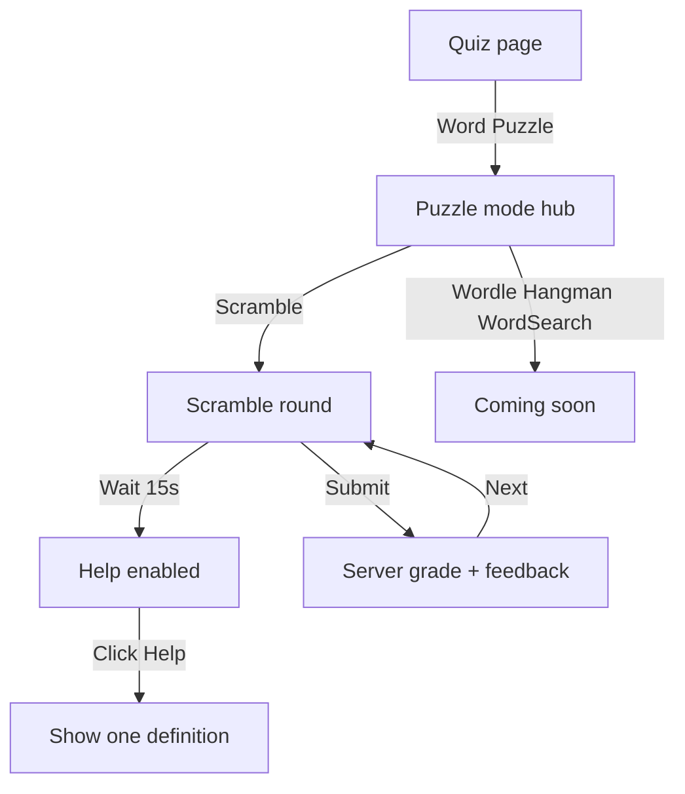

# Word Puzzle — Mode Hub + Scramble MVP

Plan implement game word puzzle từ vocab đã lưu của user.

## Quyết định đã chốt

- **Hub modes** → chọn mode → vào màn chơi tương ứng.
- **Playable ngay:** Scramble/Anagram only.
- **Hiện sẵn (Coming soon):** Wordle, Hangman, Word Search — click → flash/alert “Coming soon”.
- **Client v1:** Web Blade only (cùng pattern `backend/resources/views/user/quiz.blade.php`). API Sanctum song song để mobile/extension nối sau — **không** làm Flutter/extension UI trong đợt này.
- **Nav:** không thêm tab thứ 6. Entry từ trang Quiz (banner/link “Word Puzzle”) + route `/home/puzzle`.

## UX flow



**Hub** (`/home/puzzle`): grid/list 4 mode cards — Scramble (Play), 3 mode còn lại badge “Soon”.

**Scramble play** (`/home/puzzle/scramble`):

- **Ban đầu không hiện meaning** — chỉ scrambled letters + ô nhập từ + độ dài từ (optional: `n letters`).
- User nhập từ → Submit.
- Feedback Correct / Incorrect.
- **Sau submit:** hiện full entry giống trang vocab detail — word, phonetic, audio (nút pronounce), toàn bộ meanings + examples (+ syn/ant tabs nếu partial đã có). Tái dùng partial `user/partials/dictionary-entry-tabs` như `vocab-show.blade.php`.
- Nút Next / Back về hub.

### Help (Scramble)

- Nút **Help** trên màn chơi: **disabled** trong **15 giây** kể từ lúc round bắt đầu (client timer; reset mỗi Next).
- Sau 15s → enable.
- Click Help → hiện **một meaning** (`definition` + có thể kèm `part_of_speech` nếu có).
- **Không** hiện examples, synonyms, antonyms, phonetic, audio.
- Mỗi round chỉ reveal **một lần** (sau khi đã help thì nút disable / ẩn).
- Meaning lấy từ primary meaning của dictionary entry (cùng nguồn quiz); không invent text.

## Pool từ & ràng buộc

- Nguồn: vocab của user qua `UserVocabularyRepository::listForUser` (như `GetNextQuizQuestionHandler`).
- **Eligible:** single-token, chỉ `a-z`, độ dài **3–14** (bỏ phrase có space/`'`/`-`).
- **Minimum:** ≥ 1 từ eligible; nếu không đủ → message hướng về Vocabulary (không bắt ≥ 4 như MCQ).
- Weighted pick tái dùng logic `times_quizzed` / `last_quizzed_at` (copy nhẹ vào Puzzle handler; không refactor Quiz ngay).

## Backend (CQRS)

Domain mới `backend/src/Flc/Puzzle/`:

| Piece | Role |
|-------|------|
| `GetNextScramblePuzzle` + Handler | Pick word, scramble letters; giữ `correct_word` + `hint_definition` trong session/server payload nội bộ |
| Reuse `RecordQuizAttempt` | `question_type = 'scramble'` |

**Payload next trả client (không kèm đáp án / hint):**

```php
[
  'vocabulary_id' => int,
  'mode' => 'scramble',
  'scrambled' => string,     // e.g. "yppah"
  'word_length' => int,
  // correct_word + hint_definition chỉ server/session — không render sẵn trên HTML ẩn
]
```

**Reveal hint:**

- Web: `POST /home/puzzle/scramble/hint` — nếu session còn puzzle đang chơi và chưa hint → set `hint_revealed` + flash definition lên view.
- API: `POST /api/puzzle/scramble/hint` `{ vocabulary_id }` — trả `{ definition, part_of_speech? }` sau khi verify vocab thuộc user. Grade/hint luôn load từ DB by `vocabulary_id` + `userId` (không tin client).

**Ghi attempt:** reuse `RecordQuizAttempt` + `questionType: scramble`.

Wire handlers trong service provider hiện có (cùng chỗ Quiz handlers được bind).

## Controllers & routes

**Web** — `App\Http\Controllers\Web\PuzzleController`:

- `GET /home/puzzle` → hub view
- `GET /home/puzzle/scramble` → play view (session puzzle + feedback + optional hint)
- `POST /home/puzzle/scramble/next` → ask handler, flash session (clear hint state)
- `POST /home/puzzle/scramble/hint` → reveal one definition vào session
- `POST /home/puzzle/scramble/answer` → validate input vs session word; dispatch RecordQuizAttempt; flash feedback + **load full vocab entry** (word, phonetic, audio/pronounce, meanings, examples) để render detail UI

Coming-soon modes: hub link/`?mode=` → redirect hub + “Coming soon”.

**API** (Sanctum):

- `GET /api/puzzle/scramble/next`
- `POST /api/puzzle/scramble/hint` `{ vocabulary_id }`
- `POST /api/puzzle/scramble/attempts` `{ vocabulary_id, answer }` — response kèm `correct` + **full entry payload** (giống shape vocab show) để client hiện detail sau submit

Đăng ký trong `backend/routes/web.php` / `backend/routes/api.php` dưới middleware auth hiện có.

## Frontend Web

| File | Việc |
|------|------|
| `backend/resources/views/user/quiz.blade.php` | Link “Word Puzzle →” lên hub |
| `user/puzzle/index.blade.php` | Mode cards |
| `user/puzzle/scramble.blade.php` | Scrambled letters + input + Help (15s); sau submit reuse header pronounce + `dictionary-entry-tabs` như vocab detail |
| `backend/public/js/user-app.js` | Timer 15s enable Help; disable sau khi đã dùng |
| `backend/public/css/user.css` | Mode grid + letter chips + Help disabled/enabled |

Scramble UI: letter chips; input `autocomplete=off`; compare case-insensitive trim. Vùng hint chỉ render sau khi server confirm help (tránh leak definition trong HTML trước khi click).

## Phạm vi không làm (v1)

- Flutter / Chrome extension screens
- Wordle / Hangman / Word Search logic
- Tab nav mới, tags/difficulty filter, leaderboard
- Hint nâng cao (chữ cái mở, phonetic, audio, examples)

## Implementation todos

1. Thêm `Flc\Puzzle` CQRS: `GetNextScramblePuzzle` + wire `RecordQuizAttempt` (`question_type=scramble`); hint meaning server-side
2. Web routes/controller + hub Blade + scramble play (Help 15s) + link từ Quiz
3. API `next` + `attempts` + `hint` (Sanctum, ownership check)
4. CSS mode cards + letter chips + Help button states; Coming soon trên hub

## Kiểm thử tay

1. User ≥ 1 từ eligible → hub → Scramble → chơi đúng/sai → sau submit thấy full meanings/examples/phonetic/audio như vocab detail → Next.
2. Help disabled < 15s; sau 15s enable; click → 1 definition, không example; click lại không đổi / disabled.
3. User chỉ có phrase / từ < 3 chữ → message không start được.
4. Click Wordle/Hangman/Word Search → “Coming soon”.
5. API `next` / `hint` / `attempts` ownership đúng; `attempts` trả full entry.
